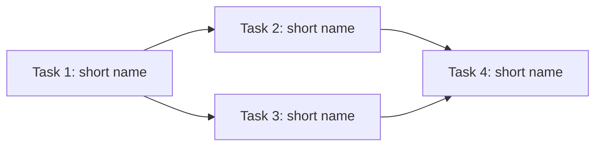

# Plan from Spec

Convert a product spec (`docs/specs/*.md`) into a structured, executable delivery plan (`docs/plan.md`) with numbered tasks, dependency tracking, complexity estimates, and a mermaid dependency graph.

---

## 1. Input

### Required

| Input | Location | Description |
|-------|----------|-------------|
| `spec.md` | `docs/specs/` | The product spec to decompose. Must contain requirements, user stories, or acceptance criteria. |
| `CLAUDE.md` | Project root | Project conventions, tech stack, coding standards. |

### Optional

| Input | Location | Description |
|-------|----------|-------------|
| `architecture.md` | `docs/` | System architecture — components, boundaries, data flow. If missing, the skill flags this for the architect before proceeding. |
| `plan.md` | `docs/` | Existing plan to update incrementally (for spec revisions). |
| Existing source code | `src/` | Helps identify what already exists vs. what needs building. |

### Input Validation

Before proceeding, verify:
- [ ] Spec file exists and is non-empty
- [ ] Spec contains at least one identifiable requirement (user story, acceptance criterion, or feature description)
- [ ] CLAUDE.md is readable and contains tech stack info
- [ ] If architecture.md is missing, flag it — do NOT invent architecture assumptions

---

## 2. Thinking Frameworks

### Task Decomposition Heuristics

**Vertical Slicing** — Every task should deliver a thin, demonstrable slice of functionality from API to UI (or from input to output). Avoid horizontal tasks like "set up all database models" or "build all API endpoints."

Ask: *"Can I demo this to the PM when it's done?"* If yes, it's a good task. If no, slice thinner.

**The 4-Hour Rule** — No single task should take more than 4 hours of focused implementation. If you estimate longer, decompose further. A task that takes "about a day" is actually 2-3 tasks.

**Dependency-First Ordering** — Identify what blocks what. Data models block API endpoints. API endpoints block UI integration. Auth blocks everything that needs it. Map these before assigning phases.

**Interface-Boundary Tasks** — When two components interact, create an explicit task for the integration point. "Component A works" and "Component B works" does not guarantee "A talks to B correctly."

### Complexity Estimation (T-Shirt Sizes)

| Size | Meaning | Typical Duration | Examples |
|------|---------|-----------------|----------|
| **XS** | Trivial change, config, copy | < 30 min | Add env var, update copy, add a route alias |
| **S** | Single-file change, well-understood | 30 min – 1 hr | Add a utility function, write a simple component |
| **M** | Multi-file, some decisions needed | 1 – 3 hrs | New API endpoint with validation, component with state |
| **L** | Multi-file, integration, edge cases | 3 – 4 hrs | Feature with DB + API + UI, auth flow |

**Never use XL.** If something feels XL, it must be decomposed into M or L tasks.

### Anti-Patterns to Detect

| Anti-Pattern | Symptom | Fix |
|-------------|---------|-----|
| **Mega-task** | Task description has "and" more than twice | Split at each "and" |
| **Vague task** | No clear acceptance criteria | Rewrite with specific, testable criteria |
| **Circular dependency** | A depends on B depends on A | Extract shared piece into a new task C |
| **Orphan task** | Task doesn't trace to any spec requirement | Remove it or find the implicit requirement |
| **Assumption task** | Task assumes architecture not yet defined | Flag for architect, add architecture task first |
| **Test-last grouping** | "Write all tests" as a single task | Tests belong with the feature task, not separate |
| **Infrastructure-only phase** | Phase 1 is all setup with nothing demoable | Mix infrastructure into feature tasks |

### Phase Assignment Rules

- **Phase 1:** Foundation — data models, auth, core utilities. Must produce at least one demoable outcome.
- **Phase 2:** Core features — the primary user flows described in the spec.
- **Phase 3:** Secondary features — nice-to-haves, edge cases, polish.
- **Phase 4:** Hardening — error handling improvements, performance, monitoring.

Each phase should be independently deployable. No phase should have more than 8 tasks.

---

## 3. Expected Output

### Primary Artifact: `docs/plan.md`

```markdown
# Delivery Plan

> Generated from: `docs/specs/{spec-name}.md`
> Last updated: {date}
> Status: DRAFT | APPROVED | IN_PROGRESS | COMPLETE

## Overview

{1-2 sentence summary of what this plan delivers}

## Phases

### Phase 1: {Phase Name}
Goal: {What is demoable at the end of this phase}

### Phase 2: {Phase Name}
Goal: {What is demoable at the end of this phase}

{... more phases as needed}

## Task Table

| # | Task | Phase | Deps | Size | Acceptance Criteria | Status |
|---|------|-------|------|------|---------------------|--------|
| 1 | {task description} | 1 | — | S | {testable criterion} | TODO |
| 2 | {task description} | 1 | 1 | M | {testable criterion} | TODO |
| 3 | {task description} | 1 | 1,2 | L | {testable criterion} | TODO |
| ... | | | | | | |

## Dependency Graph



## Spec Coverage Matrix

| Spec Requirement | Task(s) | Notes |
|-----------------|---------|-------|
| {requirement from spec} | #1, #3 | |
| {requirement from spec} | #2 | |

## Gaps & Risks

- {Any spec requirements that couldn't be fully decomposed}
- {Architecture assumptions that need validation}
- {External dependencies or unknowns}
```

### Secondary Outputs

- Console summary with task count, phase count, and any warnings
- List of gaps or ambiguities found in the spec (presented to user)

---

## 4. Review / Rubric

### Coverage Criteria

| Criterion | Check | Severity |
|-----------|-------|----------|
| Every spec requirement maps to at least one task | Cross-reference spec coverage matrix | BLOCKER |
| No orphan tasks (every task traces back to spec) | Reverse-check each task against spec | BLOCKER |
| No task exceeds L complexity | Review complexity column | BLOCKER |
| All tasks have acceptance criteria | Check AC column is non-empty | BLOCKER |
| Acceptance criteria are testable | Each AC starts with a verb and is binary (pass/fail) | WARNING |
| Dependency graph is a DAG (no cycles) | Validate mermaid graph has no circular paths | BLOCKER |
| No phase has more than 8 tasks | Count tasks per phase | WARNING |
| Phase 1 has at least one demoable outcome | Review Phase 1 goal | WARNING |
| Each phase is independently deployable | Review phase boundaries | WARNING |
| No horizontal-only tasks | Check for "setup all X" language | WARNING |

### Quality Signals

**Good plan smells:**
- Tasks read like a narrative — you can follow the build order and it makes sense
- A junior developer could pick up any task and know what "done" looks like
- The dependency graph is wide (parallelizable), not a single chain

**Bad plan smells:**
- Most tasks depend on the immediately previous task (hidden waterfall)
- Acceptance criteria use words like "properly," "correctly," "well" (unmeasurable)
- One phase has 15 tasks and another has 2 (unbalanced)

---

## 5. Skill Definition (Orchestration)

### Sub-Tasks

**Step 1: Read and parse the spec**
Read `docs/specs/{spec}.md` entirely. Identify and extract every requirement, user story, or acceptance criterion. Number them for reference (R1, R2, R3...).

**Step 2: Read project context**
Read `CLAUDE.md` to understand tech stack, conventions, and constraints. Note the testing framework, component patterns, and any project-specific rules.

**Step 3: Check for architecture.md**
Look for `docs/architecture.md`. If it exists, read it and extract component boundaries, data models, and integration points. If it does NOT exist:
- Log a warning: "architecture.md not found — plan may require revision after architecture is defined"
- Proceed with reasonable assumptions, but flag each assumption explicitly in the Gaps section

**Step 4: Check for existing plan.md**
If `docs/plan.md` exists, read it. Determine if this is an incremental update (add tasks) or a full rewrite. If incremental, preserve completed tasks and their numbering.

**Step 5: Scan existing source code**
List files in `src/` to identify what already exists. Mark spec requirements that are already partially or fully implemented. This avoids creating tasks for work that's done.

**Step 6: Decompose requirements into vertical slices**
For each requirement (R1, R2, ...), break it into the smallest demoable tasks. Apply the vertical slicing heuristic: each task should touch all layers needed for its slice (model + API + UI, or whatever applies). Apply the 4-hour rule — nothing larger than L.

**Step 7: Identify dependencies between tasks**
For each task, ask: "What other tasks must be COMPLETE before I can start this?" Record dependencies. Watch for circular dependencies — if found, extract the shared concern into its own task.

**Step 8: Estimate complexity**
Assign T-shirt size (XS, S, M, L) to each task. If anything feels XL, decompose it further before continuing.

**Step 9: Assign phases**
Group tasks into phases following the phase assignment rules. Ensure Phase 1 has a demoable outcome. Ensure no phase exceeds 8 tasks. Rebalance if needed.

**Step 10: Order tasks by dependencies within phases**
Within each phase, order tasks so that dependencies come before dependents. Tasks with no dependencies come first. Assign sequential task numbers across all phases.

**Step 11: Generate mermaid dependency graph**
Create a `graph LR` mermaid diagram showing all tasks and their dependency edges. Verify visually that no cycles exist.

**Step 12: Build spec coverage matrix**
Map every requirement (R1, R2, ...) to the task(s) that implement it. If any requirement has no task, either create a task or document it as a gap.

**Step 13: Write docs/plan.md**
Assemble the full plan document using the output template. Include all sections: overview, phases, task table, dependency graph, coverage matrix, and gaps.

**Step 14: Cross-check and self-review**
Run through the rubric checklist. Fix any BLOCKER issues before presenting. Note any WARNING issues for the human review.

**Step 15: Report results**
Present a summary to the user: total tasks, phases, any gaps found, any warnings from the rubric, and any assumptions made due to missing architecture.

---

## 6. HITL Build

### Agent Responsibilities (Autonomous)

- Reading and parsing the spec
- Extracting requirements
- Decomposing into tasks
- Identifying dependencies
- Estimating complexity
- Generating the plan document
- Self-reviewing against the rubric

### Human Escalation Triggers

| Trigger | What to Present | Why |
|---------|----------------|-----|
| Spec is ambiguous | Quote the ambiguous section, offer 2 interpretations | Agent should not guess business intent |
| architecture.md is missing | Warning + list of architecture assumptions being made | Human may want to create architecture first |
| Spec requirement is untestable | Quote the requirement, suggest testable rewording | Human owns the spec |
| Circular dependency detected | Show the cycle, propose extraction | Human may prefer a different decomposition |
| Spec has contradictions | Quote both contradicting requirements | Human must resolve business logic conflicts |
| Task count exceeds 30 | Present the plan but flag that scope may be too large | Human may want to split into multiple specs |

### Agent Boundaries

- **DO:** Decompose, estimate, organize, generate artifacts
- **DO NOT:** Make business decisions about priority or scope
- **DO NOT:** Assume architecture that isn't documented
- **DO NOT:** Skip requirements because they seem hard — flag them instead

---

## 7. HITL Review

### Review Level: SHORT

This skill produces a planning artifact, not code. A quick human review ensures the decomposition matches intent.

### Presentation Format

```
## Plan Summary

- Spec: {spec filename}
- Tasks: {count} across {phase count} phases
- Estimated effort: {sum of complexity in rough hours}

### Phase Overview
- Phase 1: {name} — {task count} tasks
- Phase 2: {name} — {task count} tasks
- ...

### Warnings
- {any WARNING-level rubric issues}
- {any assumptions made}

### Gaps
- {any spec requirements not fully covered}

Full plan written to: docs/plan.md
```

### Approval Flow

1. Agent presents the summary above
2. Human reviews and either:
   - **Approves** — Plan status changes from DRAFT to APPROVED
   - **Requests changes** — Agent re-runs relevant sub-tasks (Steps 6-14)
   - **Rejects** — Plan is discarded, human provides feedback for a fresh attempt

### Post-Approval

Once approved, the plan is ready for consumption by the `subagent-dev` skill, which picks up individual tasks for implementation.
